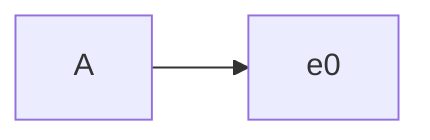
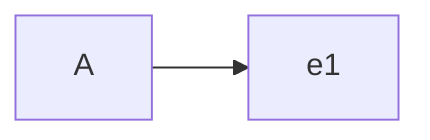
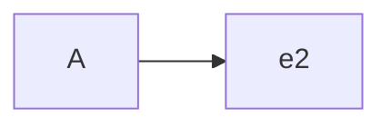
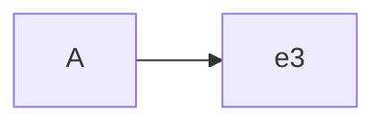
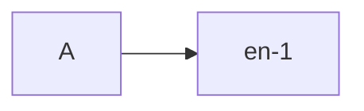

<!--more-->

*   [x] 测试pop操作，pop最后一个元素的效率远远高于pop的第一个元素

1.  数据结构

*   [x] 数据结构只是静态的描述了数据元素之间的关系。
*   [x] 高效的程序需要在数据结构的基础上设计和选择算法。

##### 程序 = 数据结构 + 算法

##### 总结：算法是为了解决实际问题而设计的，数据结构是算法需要处理的问题载体

1.  抽象数据类型(Abstract Data Type)

*   [x] 抽象数据类型(ADT)的含义是指一个数学模型以及定义在此数学模型上的一组操作。即把数据类型和数据类型上的运算捆在一起，进行封装。引入抽象数据类型的目的是把数据类型的表示和数据类型上运算的实现与这些数据类型和运算在程序中的引用隔开，使它们相互独立。
*   最常用的数据运算有五种：
    *   插入
    *   删除
    *   修改
    *   查找
    *   排序

1.  顺序表

*   [x] 顺序表，将元素顺序地存放在一块连续的存储区里，元素间的顺序关系由它们的存储顺序自然表示。

| 逻辑地址 | 元素存储 | 物理地址        |
| ---- | ---- | ----------- |
| 0    | e0   | l0          |
| 1    | e1   | l0+1\*c     |
| 2    | e2   | l0+2\*c     |
| 3    | e3   | l0+3\*c     |
| ···  | ···  | ···         |
| n-1  | en-1 | l0+(n-1)\*c |

| 逻辑地址 | 物理地址        |
| ---- | ----------- |
| 0    | l0          |
| 1    | l0+1\*c     |
| 2    | l0+2\*c     |
| 3    | l0+3\*c     |
| ···  | ···         |
| n-1  | l0+(n-1)\*c |

***

*   [x] 链表，将元素存放在通过链接构造起来的一系列存储块中。

